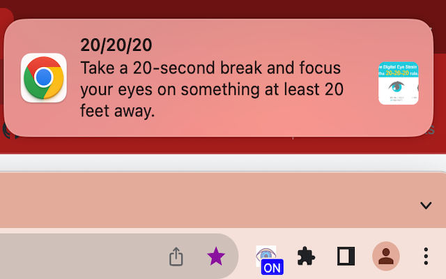

# 202020

Chrome extension to keep you aware of the 20-20-20 rule.

> Every 20 minutes, take a 20-second break and focus your eyes on something at least 20 feet away.

More here: https://opto.ca/eye-health-library/20-20-20-rule
